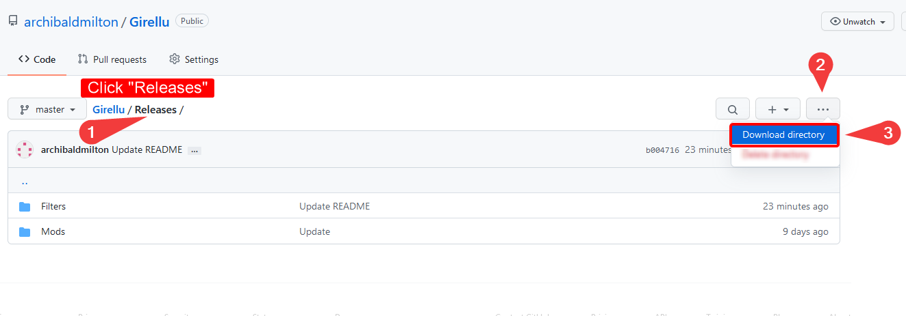
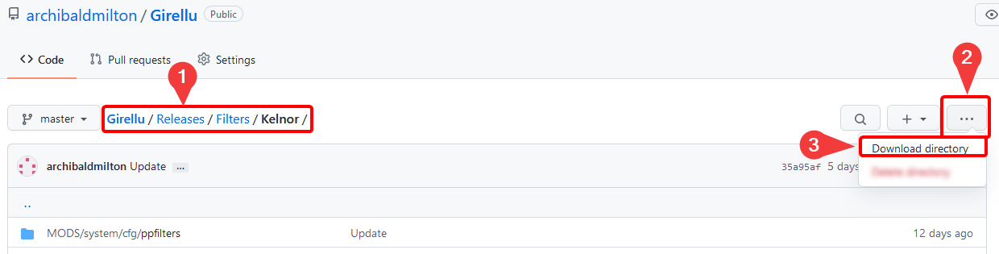

# Girellu Repository

| Personally curated content for Assetto Corsa. |
|:---:|
|  |

## How to Download
1. Login into or create a [GitHub account](https://github.com/join).
2. Install [Refined GitHub](https://github.com/sindresorhus/refined-github#install "GitHub Repository") browser extension.

| All of the content can be downloaded by doing so: |
|:---:|
|  |

| Mods can be individually downloaded by clicking the mod itself: |
|:---:|
|  |

## FAQ
"*What do these folders mean?*"
* "Releases" is where downloadable content reside.
* "Resources" is where general AC information can be read.
* "src" is the repository's media/documentation folder.

"*Why host on GitHub?*"
* Avoid community feuds (Discord servers, RaceDepartment, etc.)
* Easier to host.
* Quicker to host.

## Related Communities
Custom Shaders Patch | Sol WeatherFX | Girellu (Troubleshooting and help)
|:---:|:---:|:---:|
https://discord.gg/SWryb5V | https://discord.gg/7YVrS4ydaA | https://discord.gg/jgG738MtCe
https://www.patreon.com/x4fab | https://www.patreon.com/peterboese | -
