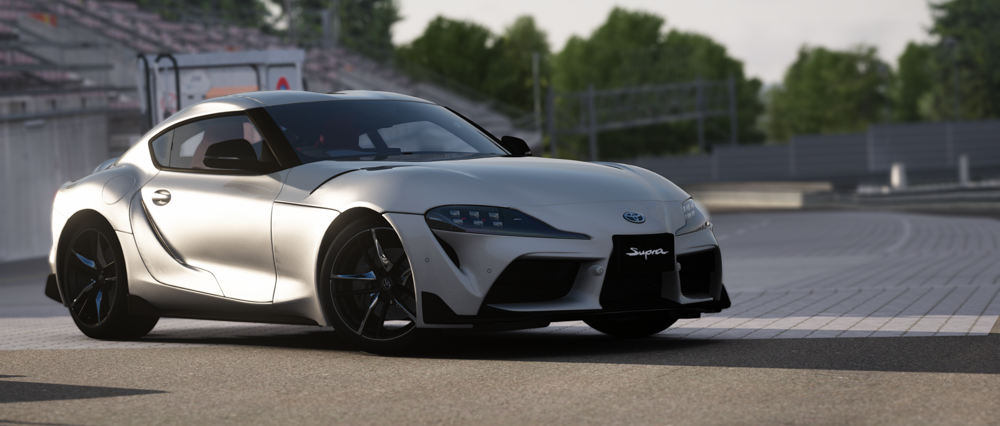
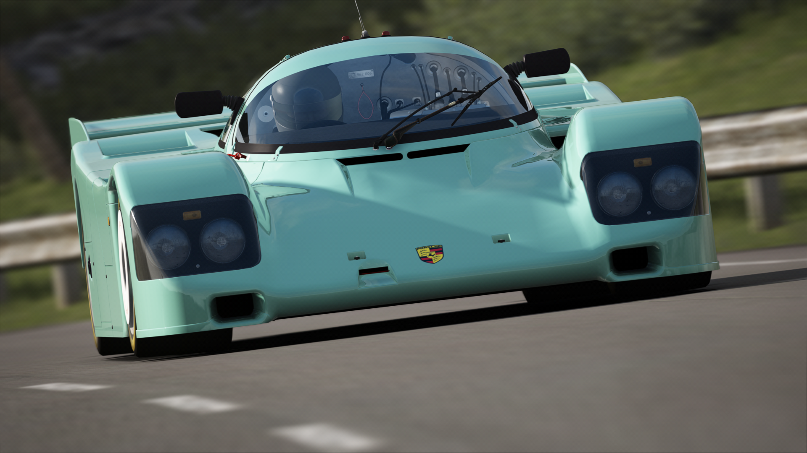
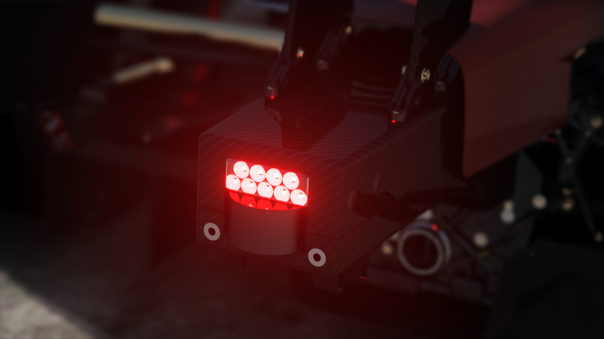

# Gorilla Filter
Absolute neutralism.

## Filter Notes
This is an ongoing project that achieves to make the most neutral filter for both driving and photography. Each filter update experiments new approaches at creating soft shadows, good contrast and realistic looking colors in AC. A unique feature about Gorilla filter is that is it built on minimalism. Unlike other filters, Gorilla filter only uses essential Sol config functions for graphics and its other functions are completely static, while relying on good tone mapping. An important consideration is that the filter's brightness may vary across different maps due to the way AC handles lighting.

**CSP Presets:**

Screenshotting: https://acstuff.ru/s/JVumvw

Driving: https://acstuff.ru/s/mIqhRS

**Video Presets:**

Screenshotting: https://acstuff.ru/s/ZeBYmB

Driving: https://acstuff.ru/s/3F1snY

**Sol:**

This filter recommends using Sol WFX's 2D clouds rendering method which is found on Page 7 in the Sol config under "Clouds Render Method" (set the slider to 0.)

Contact @Philip#8036 on Discord for questions and concerns about Gorilla filter.