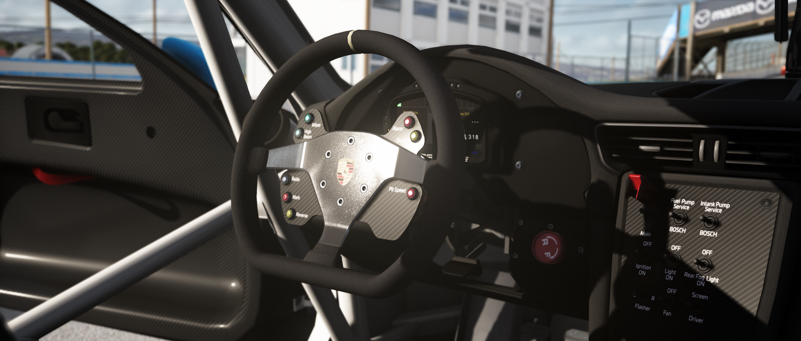

# K34 Filter
Rekindling Kelnor's legacy.

## Filter Notes
This filter was originally made by Kelnor. However, Kelnor has disappeared from the internet for some unknown reason, leaving his filter abandoned. The filter now has been revived by Phillip with a new direction on improving Kelnor's well renowned glare, while maintaining practicality for driving. Due to the bloomy nature of K34, there is to be expected overexposure on bright surfaces.

**Sol:**

This filter recommends using Sol WFX's 2D clouds rendering method which is found on Page 7 in the Sol config under "Clouds Render Method" (set the slider to 0.)

Contact @Philip#8036 on Discord for questions and concerns about K34 filter.