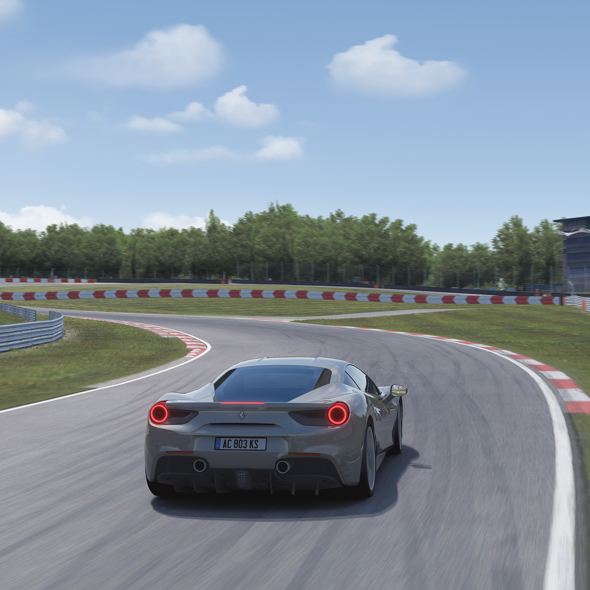
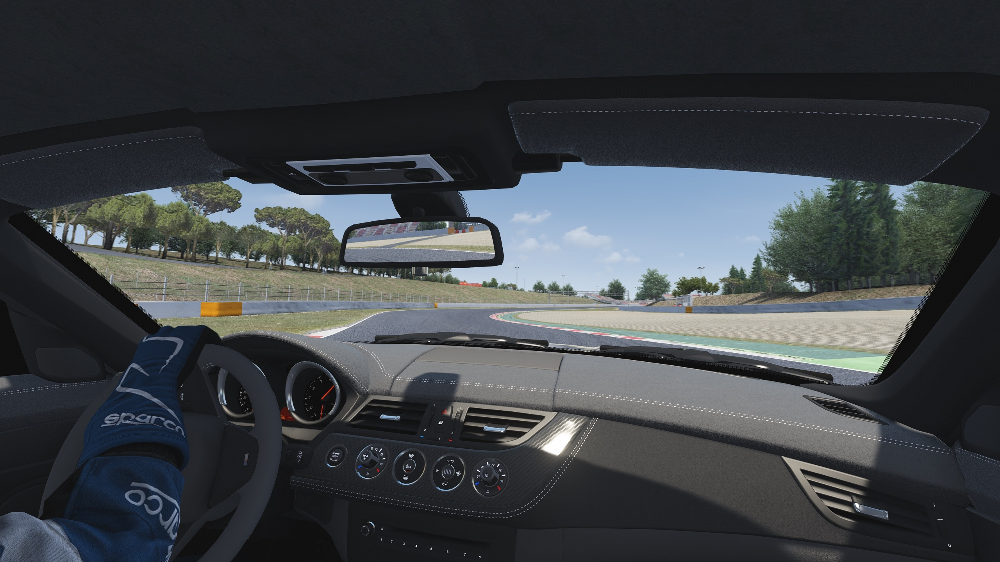

# Natural Mod Filter
Attempt to replicate what the eye sees rather than a camera. No chromatic aberration, lens flares, or erratic autoexposure.

## Filter Notes
This filter aims to get the best onboard view for driving rather than create photo-real external screenshots, saves approximately 15 FPS over other default filters.

**Natural_Mod:**
* Based on the default filter with the main tweaks.
* Camera effects like star shapes, chromatic aberration, vignetting etc. disabled.
* Autoexposure disabled (except when transitioning to night with Sol.)
* Glare tweaked for balanced interior and exterior effects.
* Neutral Colour temperature.
* Subtle tweaks to gamma, brightness, contrast saturation etc.
* Includes Sol custom config.

**Natural_Mod_Photomode:**
* For screenshots only, same as Natural_Mod except tuned to look more like a camera.
	* i.e. high quality DOF effect, shorter godrays, higher contrast, slight vignette.
* Includes Sol custom config.

**Natural_Mod_Base:**
* For users of default WeatherFX implementation (less resource intensive than Sol). Tuned for daytime driving, night time is a bit brighter than I would like, but I don't think filter .lua is possible with default WeatherFX implementation to work around this.

___
**Frequently Asked Questions:**

*"Some tracks are too bright!"*

The filter is tuned to get a dazzling effect when the sun is high in summer, but on some mod tracks with different shader values, this might end up looking way too bright. Assuming you use Sol, use the ta_exp_fix adjustment in the Sol Config app to easily fix these tracks, without compromising others.

*Warning for VR Users:*

If you use Content Manager and VR, ensure that "Override default PP filter in Oculus Rift mode" is ticked. It is recommended to disable Crepuscular Rays/Sunrays in the launcher due to this [issue](http://www.assettocorsa.net/forum/index.php?threads/oculus-1-7-3-godrays-rendered-from-all-angles-rather-than-just-from-sun.34556/ "assettocorsa.net")

*"I want to fine tune my display!"*

If your display has a poor black level (e.g. like the Oculus Quest 2 LCD), you could slightly increase contrast_day or decrease gamma_base or exposure at the top of the .lua file.

### Donate: https://paypal.me/ears1991