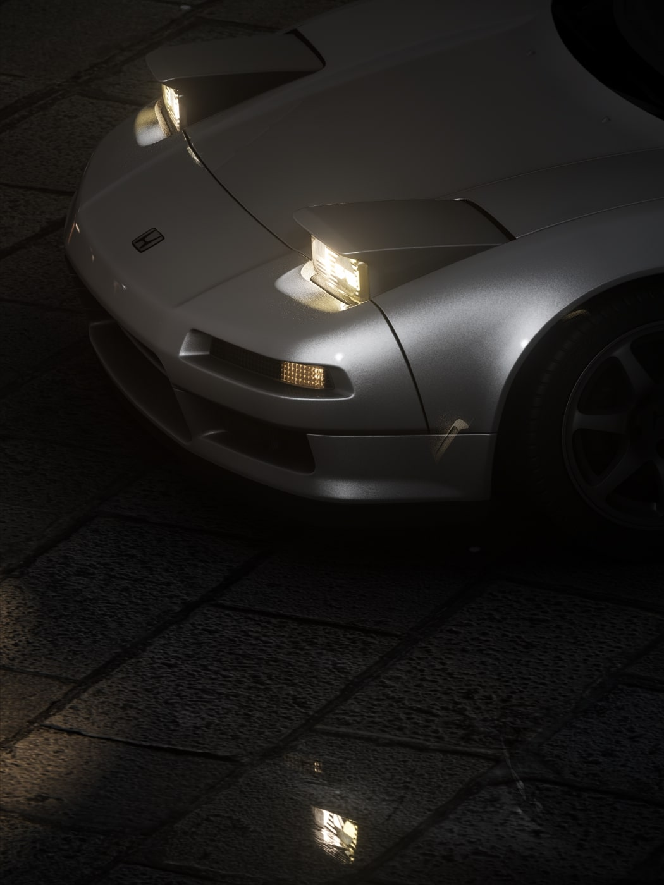
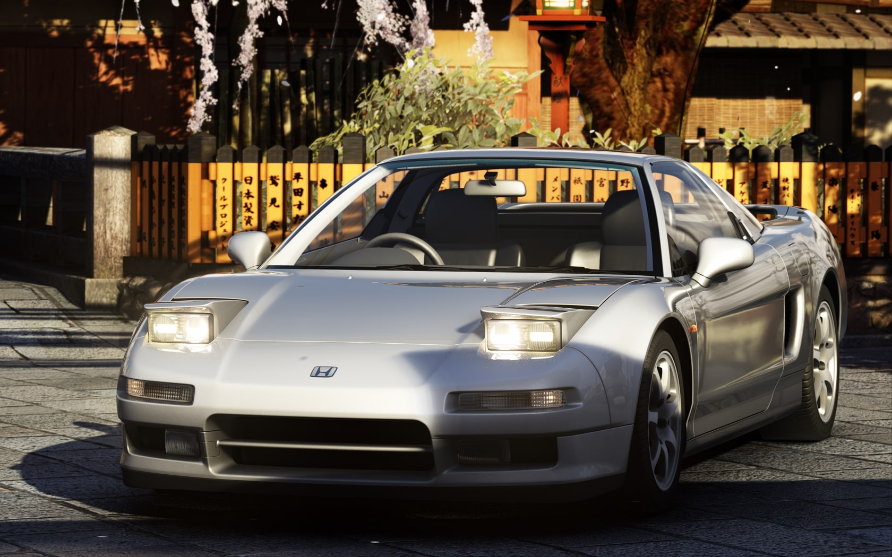
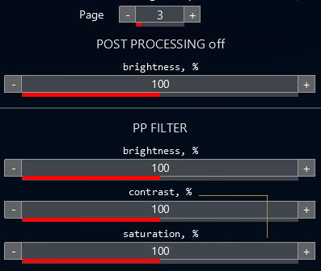

# Photorealistic Filter
This post processing filter tries to give a realistic driving experience. It has natural colors and simple visuals; here, you won't find a filter with extreme colorgrading.

Inside the folder, you will have:
* Photorealistic_Filter:
Low contrast and less strong and beautiful DOF and bloom.
* Photorealistic_Filter_PHOTO:
More contrast, it's darker and uses better and more beautiful DOF and bloom.

CSP Presets:
* Screenshotting: https://acstuff.ru/s/KX7IFo
* Driving: https://acstuff.ru/s/j7tNVt

Frequently Asked Questions:

**The sky looks dark and the lighting is broken!**

Make sure you are using a updated version of Sol WFX. If you can't fix it, feel free to report it on the discussion page or send me a direct message.

**It has too much contrast/saturation/brightness!**

If the filter doesn't fit your taste/monitor calibration you can follow a simple step to customize it:
In Sol Config app go to page 3 (page number may vary depending on Sol version)

Here you can tweak these 3 values under "PP FILTER"
