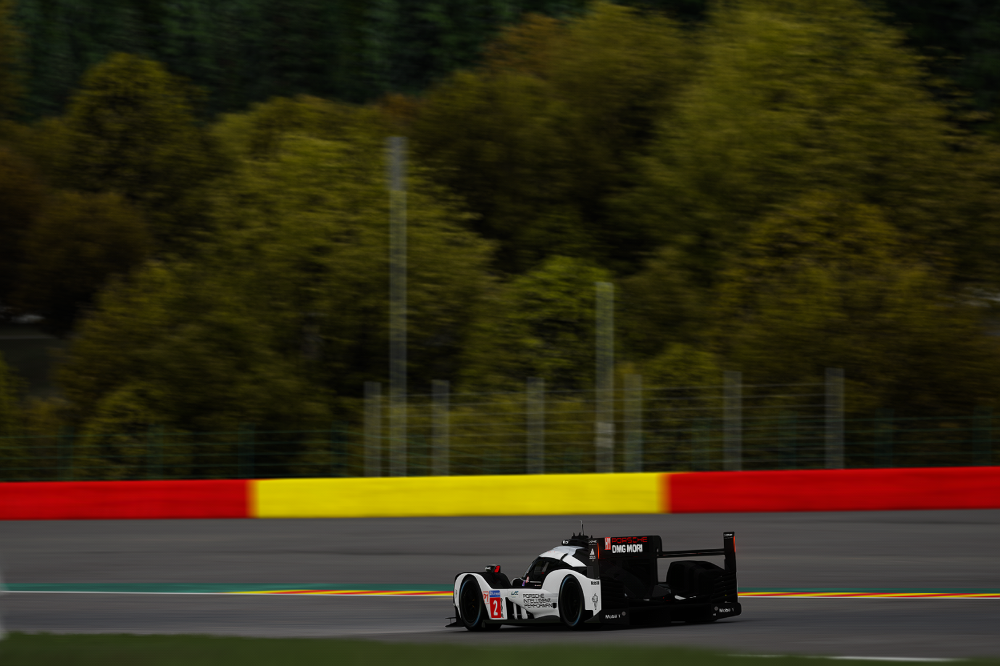
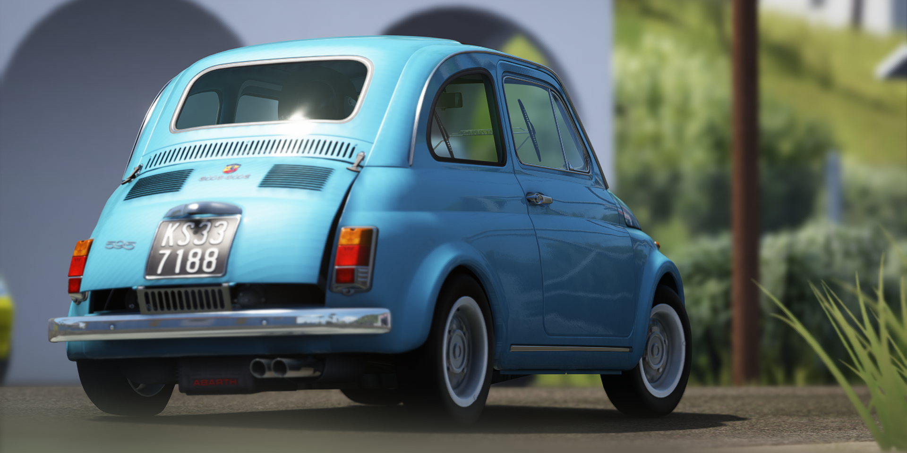

# BRUH Filter
Yet another photography filter.

| BRUH |
|:---:|
|  |

| BRUHg |
|:---:|
| ") |

| BRUHgp |
|:---:|
|  |

## Filter Notes
The name BRUH came from how bad the filter had originally looked.

**BRUH**

Use with BaseWFX

**BRUHg**

Use with BaseWFX and includes experimental CSP gamma fix

**BRUHgp**

Made for Pure WFX and includes experimental CSP gamma fix