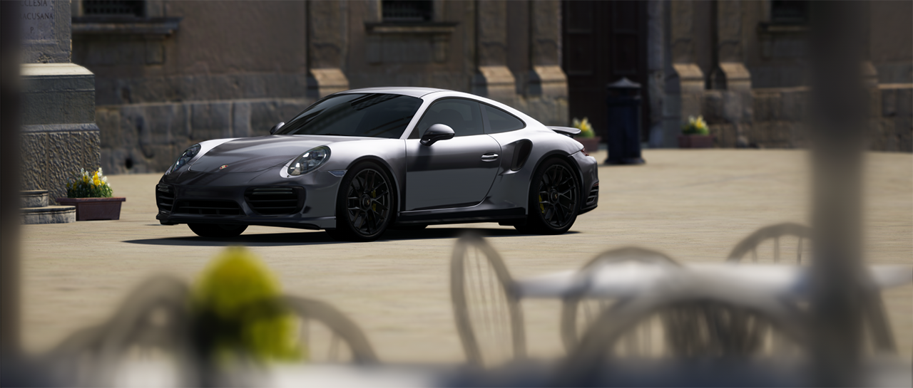
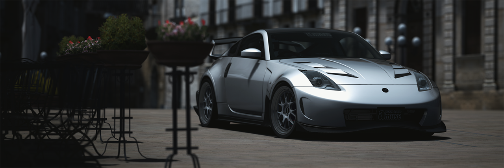
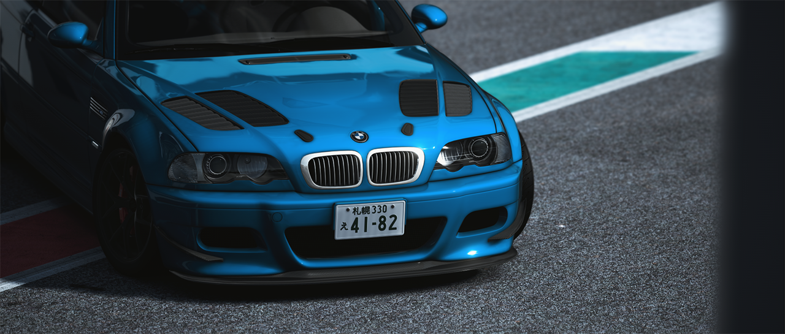
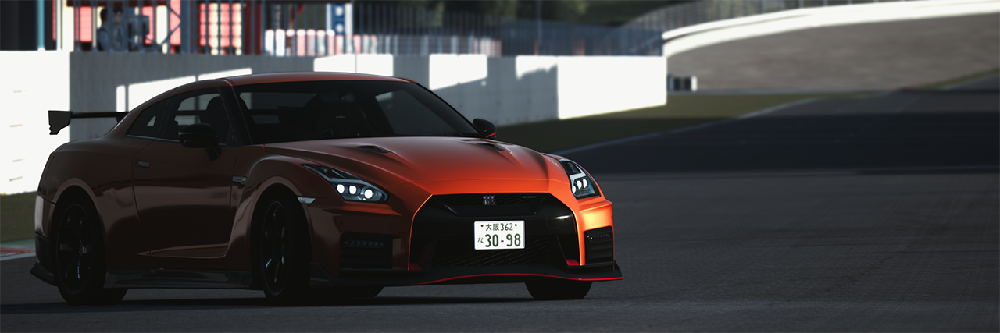
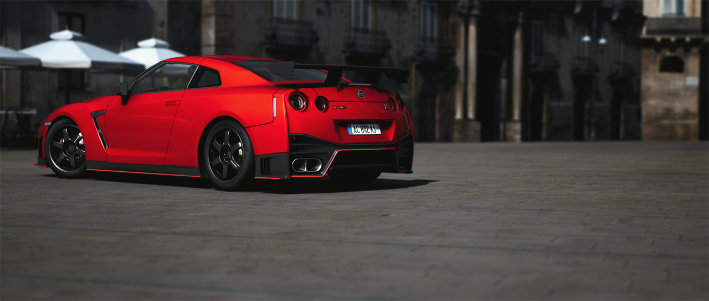
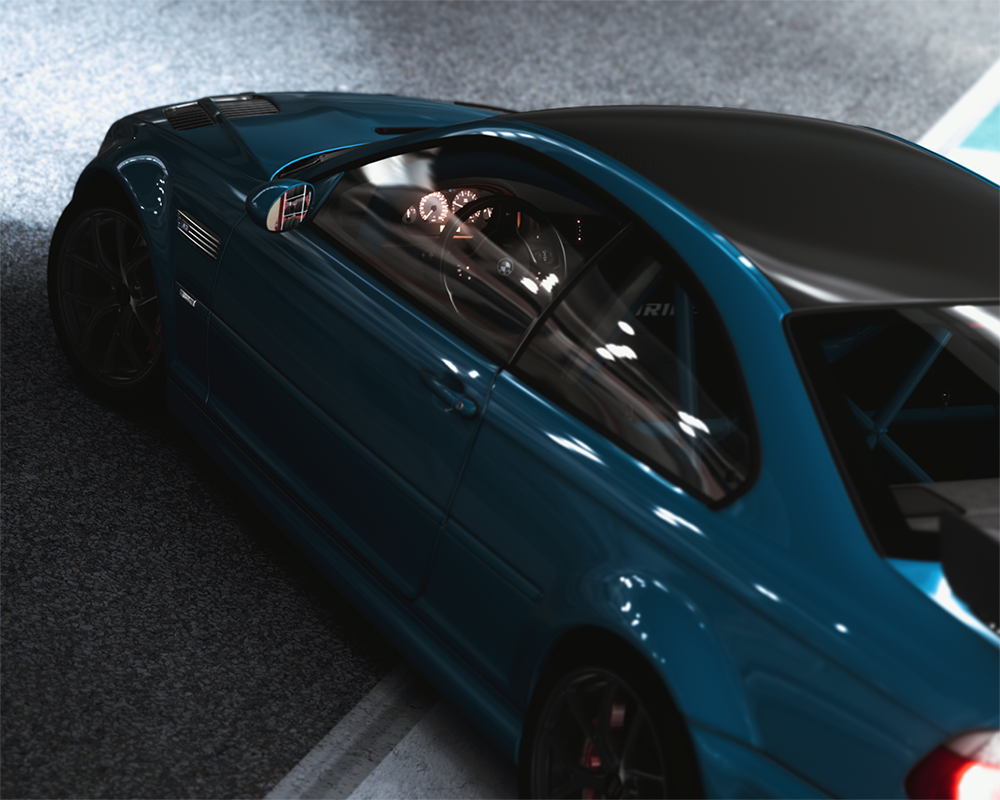

# pclipse Color Graded Filters

Artistically color graded filters for screenshotting and driving.

| PC_Daily |
|:---:|
| PC_Daily is a "set and forget" filter great for both screenshotting and driving. |
|  |
|  |

| PC_Intrinsic |
|:---:|
| PC_Intrinsic has softer color grading and is the most balanced filter of this pack; it can be used for natural looking shots. |
|  |
|  |
|  |
|  |

| PC_Noire |
|:---:|
| PC_Noire is meant to be somewhat natural but neutral; it is best used during night or in dark conditions. The filter has a wide exposure range so adjust the exposure slider to get the lighting you prefer in your shot. |
|  |

| PC_Bland |
|:---:|
| PC_Bland has duller color notes but still allows colors to pop with color grading. The filter is great for gloomy type weather; however, it still looks great in clear/scattered cloud skies depending on sun angle. |
|  |
|  |

| PC_Satire |
|:---:|
| Unlike PC_Bland, PC_Satire accentuates color in a subtle "teal and orange" style, similar to some popularly color graded photographs and videos. The filter works great in all times of day and all sun angles. |
|  |

## Filter Notes
> EDIT JAN 26, 2021: Trawa weather has been removed as it was determined to be not fully functional, so unfortunately my Trawa filters are obsolete until further notice.

Most filters I've released so far are fairly heavily color graded and some are extremely situational. For the longest time, PC_Intrinsic was kind of the most subtle and most user friendly filter; however, we now have PC_Daily. It's certainly no CJK's "Natural Mod" or Javire's "Photorealistic," but I am open for feedback.

Please let me know in the comments section if you have any problems, I'll try to do my best to help you out. And also if you ever have any suggestions, feel free to let me know as well!

Thank you for having a look,

pclipse