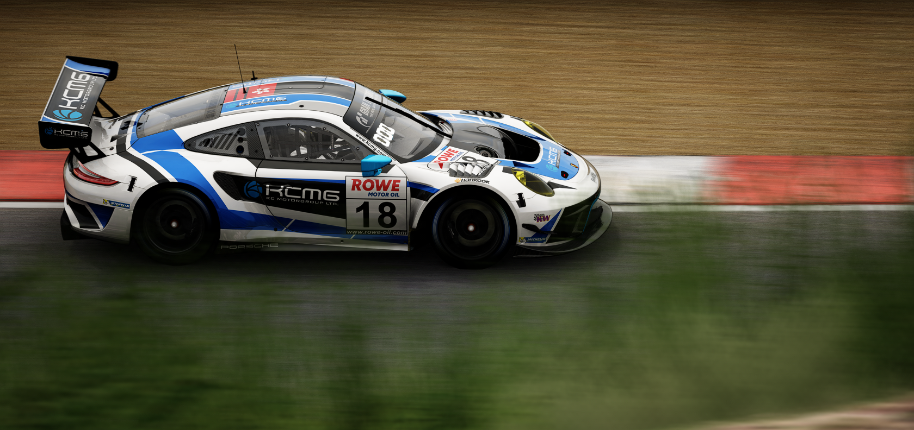
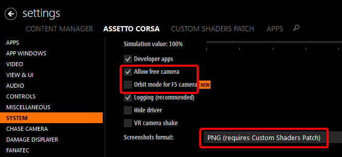

# Screenshot Guide
| Set up Assetto Corsa to make screenshots. |
|:---:|
|  |
### Install Content Manager (CM)
|  |
|:---:|
| Go to the Content Manager [GitHub releases][1] and look for a release with the *Latest release* tag and download its ZIP file. |

|  |
|:---:|
| Unzip the ZIP file in the download folder. |

<!-- github screenshot -->
### Install Custom Shaders Patch (CSP)
|  |
|:---:|
| 1. Download Custom Shaders Patch through Content Manager. |

|  |
|:---:|
| 2. Click the most recent version to update CSP. |
> CM initially downloads the *recommended* CSP version, which is typically outdated. Disregard the flags next to the version numbers, as they are inaccurate for describing CSP version stability. Ask in the [CSP Discord server][2] whether a CSP version is suitable for making screenshots.

### Install Sol WeatherFX

Download [Sol][3] through RaceDepartment. Sol supports drag and drop installation with Content Manager. Use Sol "Install Guide" PDF to set up Sol.

>For Sol troubleshooting, seek assistance in the [Sol Discord server][4]. The Sol Discord server does have experimental versions, which are not released on RaceDepartment. Using an experimental Sol version will not negatively impact filter functionality.

### Install Filters & Files
Most filters have support for drag and drop installation with Content Manager. For manual installation, go to Assetto Corsa's Steam file directory (not the document directory,) and drag the following files into their respective location:

For filter `.INI` files 

	\assettocorsa\system\cfg\ppfilters

For `.LUA` files that may come with a filter package 

	\assettocorsa\system\cfg\ppfilters\sol_custom_configs

Video Settings shared as `.CMPRESET` belong in

	%localappdata%\AcTools Content Manager\Presets\Video Settings

CSP Settings shared as `.INI` belong in

	%localappdata%\AcTools Content Manager\Presets\Custom Shaders Patch Presets

WeatherFX Scripts shared as `.ZIP` packages containing folders and `.LUA` belong in

	\assettocorsa\extension\weather

___
## File Setup

|  |
|:---:|
| Tick "Allow free camera," untick "Orbit mode for F5 Camera," and select PNG in "Screenshots format." |

"assettocorsa.ini" must be set read-only to prevent CM from reverting its original settings. To do this, follow the steps below:
1. Navigate to `\assettocorsa\system\cfg` (The game file directory not the document directory.)
2. Open "assettocorsa.ini"
3. Change the following parameters:

Original | Modified
---|---
[SCREENSHOT] FORMAT=JPG | [SCREENSHOT] FORMAT=PNG
[CAMERA] ALLOW FREE CAMERA=0 | [CAMERA] ALLOW FREE CAMERA=1

|  |
|:---:|
| Right click on "assettocorsa.ini" then click on *Properties*. Check the *Read-only* box and click *Apply*. This will ensure the file retains its modified parameters. |

### Game Settings (Video & CSP preset)

Video presets change Assetto Corsa video settings and CSP presets change Custom Shaders Patch settings. It is recommended to have separate CSP and Video presets for high FPS and high graphics. For optimal filter performance, consult the filter's author for video and CSP presets. Refer to [Install Filters & Files](#install-filters--files) for preset installation.

___
## In-Game Workflow
Prerequisite information for making screenshots:
* Do not use Assetto Corsa's `PHOTO MODE`; Only use CSP Photo app.
* Screenshots must be produced **in-game** with `REPLAY MODE`.
	- Motion shots are not possible without Replay mode
	- CSP graphical features do not work in AC Showroom

There are two free roam cameras which are activated by pressing F5 and F7 key. F5 camera directly links the camera to the car, while F7 camera is unlinked from the car. Both cameras have different movement and controls. It is recommended to use F7 camera rather than F5 camera.

Camera Controls | F5 Camera | F7 Camera 
:---:|:---:|:---:
Movement | WASD | Arrow keys 
Roll | F/G or B/V | None. Use CSP Photo app
Up/Down | C/Z | Page Up/Page Down
FOV | Numpad +/- | Scroll wheel Up/Down
Speed | Shift/Tab | Ctrl/Shift
Camera Focus (focus on mouse cursor) | Ctrl & Left Mouse Button or End key | Ctrl & Left Mouse Button or End key

<!-- ## Links -->
[1]: https://github.com/gro-ove/actools/releases "CM GitHub"
[2]: https://discord.gg/SWryb5V "CSP Discord Invite"
[3]: https://www.racedepartment.com/downloads/sol.24914/ "Sol Download"
[4]: https://discord.gg/7YVrS4ydaA "Sol Discord Invite"